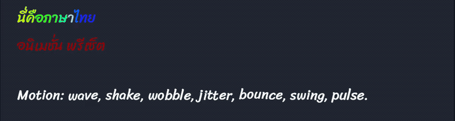
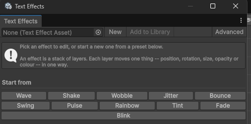

# TextBox Enhance

Per-character text animation for TextMeshPro, driven by rich-text tags.

Write `The <wave>sea</wave> was <shake>calm</shake>` into a text box and the words move.
No timeline, no GameObject per character, no second label for the animated word.



---

## What it does

- **Eleven built-in effects.** `<wave>` `<shake>` `<wobble>` `<jitter>` `<bounce>`
  `<swing>` `<pulse>` `<rainbow>` `<tint>` `<fade>` `<blink>` — they nest, they stack,
  and they take attributes: `<wave a=0.1 f=3>`.
- **A typewriter** with nine character entrances, plus `<speed=2>` and `<pause=0.4>` for
  pacing a line.
- **An effect editor** that builds new effects from layers, with a live preview and no
  recompiling.
- **Scripts with combining marks.** Thai vowels and tone marks animate with the
  consonant they sit on, and can be aimed at separately when that is the effect you
  want.
- **TextMeshPro's own tags keep working.** `<b>`, `<color>`, `<size>`, `<sprite>` and the
  rest pass straight through.

## Installing

**Window > Package Manager > + > Install package from git URL**:

```
https://github.com/motionlz/TextBoxEnhance.git?path=/Assets/TextBoxEnhance
```

Pin a version by appending a tag: `...?path=/Assets/TextBoxEnhance#v1.0.0`.

Needs **Unity 6000.0** or newer. If the project has never used TextMeshPro, run
**Tools > TextBox Enhance > Import TextMeshPro Resources** once — without it every TMP
label renders blank.

## Quick start

**GameObject > UI > Animated Text Box** drops a configured label into the scene. Then
either type into the component's **Text** field, or drive it from code:

```csharp
var box = GetComponent<AnimatedTextBox>();

box.Play("You found the <rainbow>Sunstone</rainbow>!<pause=0.4> Careful.");
box.OnRevealCompleted.AddListener(() => showContinuePrompt = true);
box.OnCharacterRevealed.AddListener(index => PlayTypingClick());

box.SkipToEnd();   // the click-to-continue half of a dialogue box
```

Distances are measured in **em** — a fraction of the font size — so an effect looks the
same on a 12pt label and a 120pt one.

## Building your own effects

**Tools > TextBox Enhance > Text Effect Editor.**



Start from a preset, watch it move at the size the game draws it, drag the sliders until
it feels right, give it a tag and save. The effect works in any text box straight away —
`<sparkle>like this</sparkle>` — and takes the same attributes as a built-in.

An effect is a stack of **layers**, and each layer moves one thing in one way:

| Moves | How |
| --- | --- |
| Sideways, up and down, rotation, size, opacity, colour | Sine, bounce, drift, shake, jitter, ramp, blink, a curve you draw, or nothing |

Three controls do most of the work: how far it travels, how many times a second, and how
far each letter lags the one before it — that last one is what turns a nodding letter
into a wave running along a word.

## Thai and other scripts with combining marks

Thai writes a syllable as a consonant plus vowels and tone marks that sit above or below
it with no width of their own, and TextMeshPro lays each one out as a separate
character. Animated naively, a vowel gets its own phase and its own random offset and
drifts off the consonant it belongs to — and the typewriter shows a bare consonant for a
moment before its vowel catches up.

TextBox Enhance groups them. A mark animates with its letter, pivots on it, and is
revealed at the same moment. The rule is Unicode's rather than Thai's, so Devanagari
matras, Arabic and Hebrew vowel points and Latin combining accents behave the same way.

When splitting them *is* the effect, every layer and every built-in tag can be aimed:

```
<shake>ทั้งคำสั่น</shake>          the whole word rattles
<shake marks>เฉพาะวรรณยุกต์</shake>   only the tone marks, over a word that holds still
<shake base>เฉพาะพยัญชนะ</shake>     only the consonants, sliding out from under them
```

You still need a font with the glyphs — the one TextMeshPro ships with covers Latin
only. Drop a font into the project, select it, and use **Assets > TextBox Enhance >
Create TMP Font Asset**.

## Documentation

Full tag reference, attributes, the component's API and how to write an effect in C#:
[`Assets/TextBoxEnhance/README.md`](Assets/TextBoxEnhance/README.md).

## Requirements

- Unity 6000.0 or newer
- `com.unity.ugui` (ships with Unity), and TextMeshPro's essential resources

## Licence

[MIT](Assets/TextBoxEnhance/LICENSE.md). No font is bundled: fonts are licensed
separately from code, and which one a project ships is its own decision.
